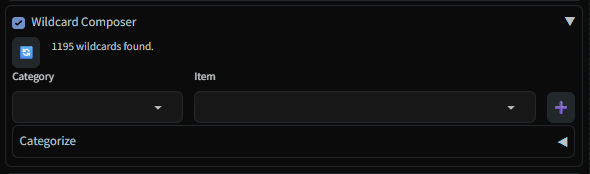
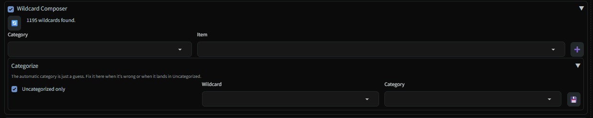
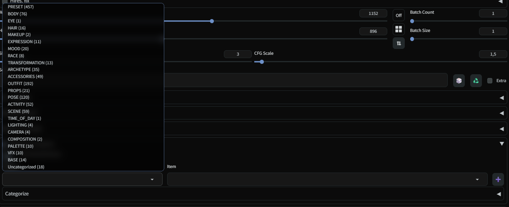

# 🎴 Wildcard Composer

> **Extension for [Stable Diffusion WebUI Forge - Neo](https://github.com/Haoming02/sd-webui-forge-classic/tree/neo)**

A **Category → Item** picker for inserting `__wildcard__` tokens into the prompt, instead of hunting through folders or typing them by hand. Renders inline under Generation in txt2img/img2img as a collapsed accordion.

> [!Important]
> Requires [sd-dynamic-prompts](https://github.com/adieyal/sd-dynamic-prompts) to actually resolve the inserted tokens at generation time — this extension only writes the token into the prompt.

---

## 📋 Table of Contents

- [Screenshots](#-screenshots)
- [Features](#-features)
- [How it Works](#-how-it-works)
- [Installation](#-installation)
- [Settings](#-settings)
- [Credits](#-credits)

---

## 🖼️ Screenshots

| Picker | Categorize panel |
|---|---|
|  |  |

---

## 🎯 Features

- **Cascading picker** — one Category dropdown feeding an Item dropdown, instead of a fixed row per category. With ~23 categories and some running into the hundreds of entries, that keeps the UI compact.
- **Auto-categorization** — every scanned wildcard is bucketed by a keyword heuristic (`data/category_rules.json`); whole composed-scene wildcards (heavy nesting, dense multi-clause lines) are detected structurally and filed under `PRESET` instead of guessed by keyword.
- **Manual override** — a "Categorize" panel to fix a wrong guess by hand, saved to `data/category_overrides.json` and always wins over the heuristic.
- **Live rescan** — 🔄 re-scans the wildcards folder without reloading the UI.
- **Fully decoupled** — no `process()` hook, never reads `p.all_prompts`. Insertion is 100% client-side; it can't affect sd-dynamic-prompts or other prompt extensions even if they're disabled or removed.

---

## ⚙️ How it Works

1. **Scan** — on load (and on refresh), it scans your wildcards folder for `.txt` and `.yaml`/`.yml` files — the same folder [sd-dynamic-prompts](https://github.com/adieyal/sd-dynamic-prompts) uses (`shared.opts.wildcard_dir`, or the first `extensions/*/wildcards` found). Everything else (`.json`, `.card`, `.safetensors`, images, ...) is ignored on purpose.
2. **Categorize** — each wildcard is filed into a category by keyword match against `data/category_rules.json` (first match wins). A `.txt` wildcard whose lines nest wildcards from more than one distinct family, or whose lines average past a comma-density threshold, is classified as a `PRESET` (a whole scene) rather than an atomic ingredient.
3. **Pick & insert** — choose a Category, then an Item, then click ➕. `javascript/wildcard_composer.js` writes the raw `__wildcard__` token straight into the native prompt textarea. Resolution at generation time is handled entirely by sd-dynamic-prompts, exactly as it already does for hand-typed wildcards.

---

## 📦 Installation

1. Open Forge Neo WebUI
2. Go to **Extensions** → **Install from URL**
3. Paste: `https://github.com/eduardoabreu81/sd-wildcard-composer-neo`
4. Click **Install** and reload the WebUI

Requires [Forge Neo](https://github.com/Haoming02/sd-webui-forge-classic/tree/neo) (Gradio 4.40.0), Python 3.10+, and `pyyaml` (installed automatically by `install.py` if missing).

---

## 🔧 Settings

`Settings → Wildcard Composer` exposes the full category taxonomy (comma-separated). Only categories that currently have at least one wildcard get a slot in the picker; adding a brand-new category name there requires reloading the UI afterward.

---

## 📄 Credits

- **[sd-dynamic-prompts](https://github.com/adieyal/sd-dynamic-prompts)** by adieyal — resolves the `__wildcard__` tokens this extension inserts
- **[KazeKaze93/sd-webui-style-organizer](https://github.com/KazeKaze93)** — source of the default category taxonomy
- **[Forge Neo](https://github.com/Haoming02/sd-webui-forge-classic/tree/neo)** by Haoming02

---

## 📜 License

MIT — see [LICENSE](LICENSE)

---

Made with ❤️ for the Stable Diffusion community

**[Report Bug](https://github.com/eduardoabreu81/sd-wildcard-composer-neo/issues)** • **[Request Feature](https://github.com/eduardoabreu81/sd-wildcard-composer-neo/issues)**

